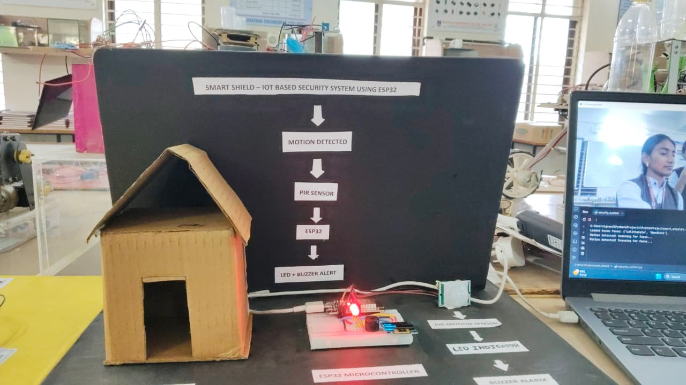

# Hybrid AI Security System

A hybrid AI-powered IoT security system utilizing an ESP32 microcontroller and a Python-based facial recognition engine. This project features real-time Telegram alerts, PIR motion detection, and a sleek, dynamic web dashboard.

## 🌟 Features

- **PIR Motion Detection**: The ESP32 constantly monitors the environment using a PIR sensor.
- **Python Face Recognition**: Upon motion detection, the ESP32 triggers a Python script (via Serial) to capture a frame, analyze it, and recognize known faces.
- **Telegram Notifications**: Sends instant messages and captured photos to your Telegram bot (alerts for intruders and greetings for known individuals).
- **Web Security Hub Dashboard**: An interactive, localized web dashboard hosted by the ESP32, displaying:
  - System status (SAFE / ALERT)
  - Detected target and AI confidence score
  - Recent events and live activity logs
- **OLED Display & Buzzer**: Local feedback with a 128x64 OLED screen and buzzer alarms.

## 📸 Project Images

*(Please upload the following images into the `images` folder to display them here)*

### Hardware Setup


### Web Dashboard


### Telegram Alerts


## 🛠 Hardware Required

1. **ESP32 Microcontroller**
2. **PIR Motion Sensor**
3. **USB Webcam** (connected to PC/Raspberry Pi)
4. **OLED Display** (SSD1306 128x64 I2C)
5. **LEDs** (Red for Alert, Green for Safe)
6. **Buzzer**
7. Jumper Wires & Breadboard
8. Cardboard Structure (for model house design)

## 💻 Software Setup

### 1. Python Environment Setup
1. Install Python 3.8+
2. Install the necessary libraries:
   ```bash
   pip install opencv-python face_recognition pyserial numpy requests 
   ```
3. Open `ai_security.py` and update the configurations:
   - `PORT`: Set to your ESP32's COM Port (e.g., `'COM7'`)
   - `BOT_TOKEN`: Enter your Telegram Bot Token.
   - `CHAT_ID`: Enter your Telegram Chat ID.
4. Create a folder named `known_faces` in the same directory as the script and place clear portrait images of known people inside it (e.g., `Lalithakala.jpg`, `Nandhini.jpg`).

### 2. ESP32 Firmware Setup
1. Install the Arduino IDE.
2. Install the ESP32 Board Manager in Arduino IDE.
3. Install the `U8g2` library by *oliver* from the Library Manager.
4. Open the `esp32_firmware/esp32_firmware.ino` file.
5. Update the WiFi credentials if you want to connect to a specific network, or use the default softAP credentials:
   - `ssid = "YOUR_WIFI_SSID"`
   - `password = "YOUR_WIFI_PASSWORD"`
6. Upload the code to your ESP32.

## 🚀 How to Run
1. Make sure your ESP32 is powered on and connected via USB.
2. Connect to the ESP32's Wi-Fi network (or your home network depending on your configuration).
3. Access the Security Hub dashboard by visiting the ESP32's IP address in your browser (default softAP address is usually `192.168.4.1`).
4. Run the Python script on your PC:
   ```bash
   python ai_security.py
   ```
5. Trigger the PIR sensor to test the system!

## 📜 License
This project is open-source and available under the [MIT License](LICENSE).
