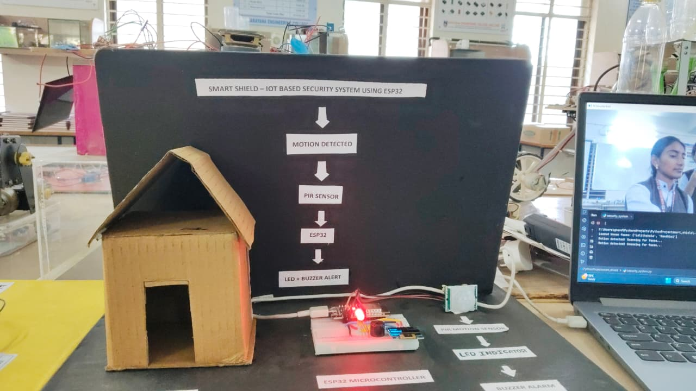

<div align="center">
  <h1>🛡️ Hybrid AI Security System</h1>
  <p><i>A hybrid AI-powered IoT security system utilizing an ESP32 microcontroller and a Python-based facial recognition engine.</i></p>
  
  <p>
    
    
    
    
  </p>
</div>

---

This project features real-time Telegram alerts, PIR motion detection, and a sleek, dynamic web dashboard to keep your environment secure.

## 🌟 Features

- **PIR Motion Detection**: The ESP32 constantly monitors the environment using a PIR sensor.
- **Python Face Recognition**: Upon motion detection, the ESP32 triggers a Python script (via Serial) to capture a frame, analyze it, and recognize known faces.
- **Telegram Notifications**: Sends instant messages and captured photos to your Telegram bot (alerts for intruders and greetings for known individuals).
- **Web Security Hub Dashboard**: An interactive, localized web dashboard hosted by the ESP32, displaying:
  - System status (SAFE / ALERT)
  - Detected target and AI confidence score
  - Recent events and live activity logs
- **OLED Display & Buzzer**: Local feedback with a 128x64 OLED screen and buzzer alarms.

## 📸 Project Images


<div align="center">
  <table>
    <tr>
      <td align="center">
        <br>
        <sub><i><b>Hardware Setup:</b> The ESP32, PIR sensor, and OLED display in action</i></sub>
      </td>
      <td align="center">
        <br>
        <sub><i><b>Web Dashboard:</b> Sleek UI showing live system status and recent events</i></sub>
      </td>
    </tr>
    <tr>
      <td colspan="2" align="center">
        <br>
        <sub><i><b>Telegram Alerts:</b> Instant notifications with captured photos sent to your phone</i></sub>
      </td>
    </tr>
  </table>
</div>

## 🛠 Hardware Required

1. **ESP32 Microcontroller**
2. **PIR Motion Sensor**
3. **USB Webcam** (connected to PC/Raspberry Pi)
4. **OLED Display** (SSD1306 128x64 I2C)
5. **LEDs** (Red for Alert, Green for Safe)
6. **Buzzer**
7. Jumper Wires & Breadboard
8. Cardboard Structure (for model house design)

## 💻 Software Setup

### 1. Python Environment Setup
1. Install Python 3.8+
2. Install the necessary libraries:
   ```bash
   pip install opencv-python face_recognition pyserial numpy requests
